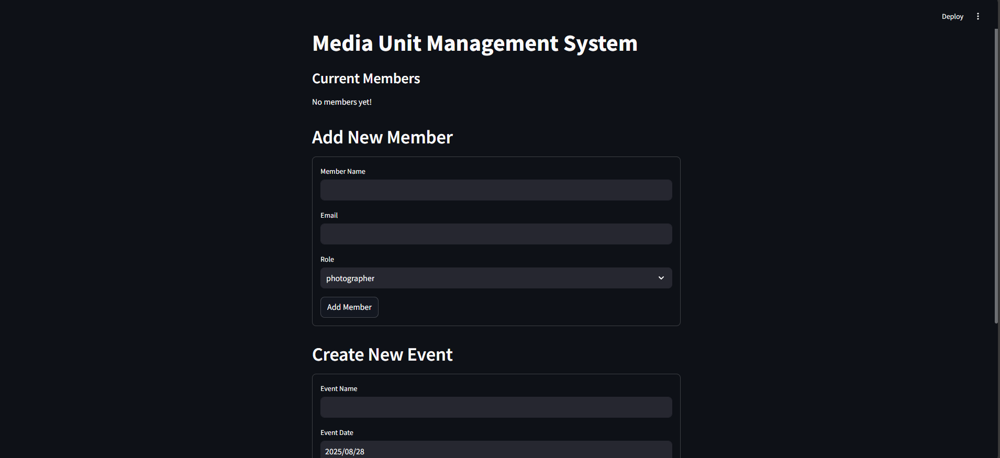
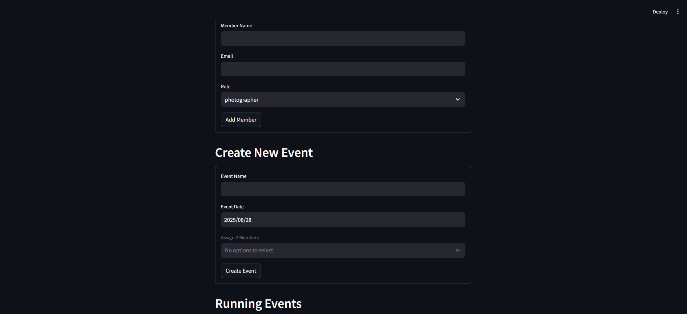

# 🎉 Event Management System  

A simple Event Management System built with **Python (Flask)** and **Supabase** as the backend.  
This app lets you create, manage, and view events easily.

---

## 🚀 Features  
- Add and view events  
- Store event data in **Supabase**  
- Simple UI for easy interaction  
- Secure API keys with `.env` or `secrets.toml`  

---

## 🛠️ Tech Stack  
- **Frontend:** HTML, CSS  
- **Backend:** Python (Flask)  
- **Database:** Supabase (PostgreSQL)  

---

## 📸 Screenshot  

Here’s how the app looks:  

   

---

## ⚙️ Setup Instructions  

### 1. Clone the repository  

`git clone https://github.com/Subhaga2000/media-unit-management.git
cd your-media-unit-management`

### 2. Create and Activate Virtual Environment

`python -m venv .venv`
#### Windows
`.venv\Scripts\activate`
#### Mac/Linux
`source .venv/bin/activate`

### 3. Install Dependencies

`pip install -r requirements.txt`

### 4. Set Up Secrets

`[supabase]`
**url = "your-supabase-url"**
**key = "your-supabase-key"**

### 5. Run the Application

`streamlit run app.py`

